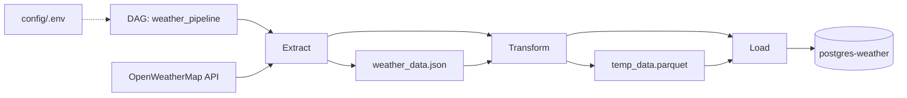

# Pipeline de Clima de São Paulo

Este projeto implementa um pipeline ETL para coletar dados do clima em São Paulo, transformar esses dados e carregá-los em um banco de dados PostgreSQL usando Apache Airflow em Docker.

## Visão Geral

O projeto extrai dados da API OpenWeatherMap, transforma o JSON retornado em um DataFrame pandas e carrega o resultado em uma tabela PostgreSQL chamada `sp_weather`.

### Componentes principais

- `docker-compose.yaml`: define a infraestrutura de desenvolvimento com Airflow, Redis, PostgreSQL e um banco de dados de destino para weather.
- `dags/weather_dag.py`: DAG Airflow que executa as etapas `extract`, `transform` e `load`.
- `src/extract_data.py`: função `extract_weather_data(url)` para baixar o JSON da API e salvar em `data/weather_data.json`.
- `src/transforme_data.py`: função `data_transformations()` que normaliza o JSON, renomeia colunas e converte timestamps.
- `src/load_data.py`: função `load_weather_data(table_name, df)` que grava o DataFrame no PostgreSQL usando SQLAlchemy.
- `config/.env`: arquivo local de variáveis de ambiente usado pelo DAG e pelos módulos de load. Não devem ser commitados segredos neste arquivo.

## Estrutura do Projeto

- `config/` - arquivos de configuração, incluindo `.env`
- `dags/` - definição do DAG Airflow
- `src/` - lógica de extração, transformação e carga
- `data/` - dados extraídos localmente
- `logs/` - logs do Airflow
- `docker-compose.yaml` - ambiente de containerização
- `pyproject.toml` - dependências Python do projeto

## Requisitos

- Python 3.12+
- Docker
- Docker Compose
- `docker compose` ou `docker-compose`

## Variáveis de Ambiente

O projeto usa um arquivo local de variáveis de ambiente para configurar a API e o banco de dados.

As variáveis esperadas incluem:

- `API_KEY` - chave da API OpenWeatherMap
- `database` - nome do banco de dados PostgreSQL de destino
- `user` - usuário do PostgreSQL
- `password` - senha do PostgreSQL
- `host` - host do PostgreSQL para execução local
- `port` - porta do PostgreSQL
- `docker_host` - host usado dentro do container Docker para conectar-se ao banco de destino

> Mantenha dados sensíveis fora do repositório. Crie `config/.env` localmente a partir de `config/.env.example` e não compartilhe chaves em público.

> O DAG `dags/weather_dag.py` carrega o arquivo `.env` de `config/.env` e constrói a URL da API com `API_KEY`.

## Execução com Docker Compose

1. Certifique-se de que o arquivo `config/.env` esteja configurado corretamente.
2. No diretório raiz do projeto, execute:

```bash
docker compose up -d
```

3. Aguarde os serviços subirem e acesse a interface do Airflow em:

```text
http://localhost:8080
```

4. No Airflow, ative ou execute manualmente o DAG `weather_pipeline`.

## Detalhes do DAG

- `dag_id`: `weather_pipeline`
- `schedule`: `0 */1 * * *` (a cada hora)
- `start_date`: `2026-06-17`
- `catchup`: `False`
- Tarefas:
  - `extract`: chama `extract_weather_data(url)` e salva o JSON em `data/weather_data.json`
  - `transform`: chama `data_transformations()` e salva o parquet em `/opt/airflow/data/temp_data.parquet`
  - `load`: lê o parquet e insere os dados em `sp_weather`
  - `load`: lê o parquet e insere os dados em `sp_weather`

## Diagrama do Pipeline

Diagrama simplificado do fluxo ETL (Mermaid):



## Dados e Tabela de Destino

- Arquivo temporário criado pelo DAG: `/opt/airflow/data/temp_data.parquet`
- Tabela de destino no PostgreSQL: `sp_weather`
- A conexão de destino é configurada a partir de `config/.env` e depende do valor de `docker_host` quando o projeto roda em Docker.

## Como testar localmente

O pipeline principal também pode ser executado localmente com scripts Python, mas o `dags/weather_dag.py` é a fonte de verdade para execução no Airflow.

## Observações

- O `config/.env` contém dados sensíveis e não deve ser enviado para repositórios públicos.
- Se quiser rodar fora do Docker, atualize `host` e `port` no `.env` e instale as dependências do `pyproject.toml`.
- O projeto já inclui `postgres-weather` como host Docker para o banco de destino quando executado dentro dos containers.

## Dependências

Conforme `pyproject.toml`:

- `pandas>=3.0.3`
- `psycopg2-binary>=2.9.12`
- `python-dotenv>=1.2.2`
- `requests>=2.34.2`
- `sqlalchemy>=2.0.51`

## Próximos passos recomendados

- Criar um arquivo `config/.env.example` com variáveis de ambiente de exemplo.
- Adicionar um processo de criação de tabela `sp_weather` se ainda não existir.
- Validar e tratar falhas de API/JSON no `extract_data.py`.

